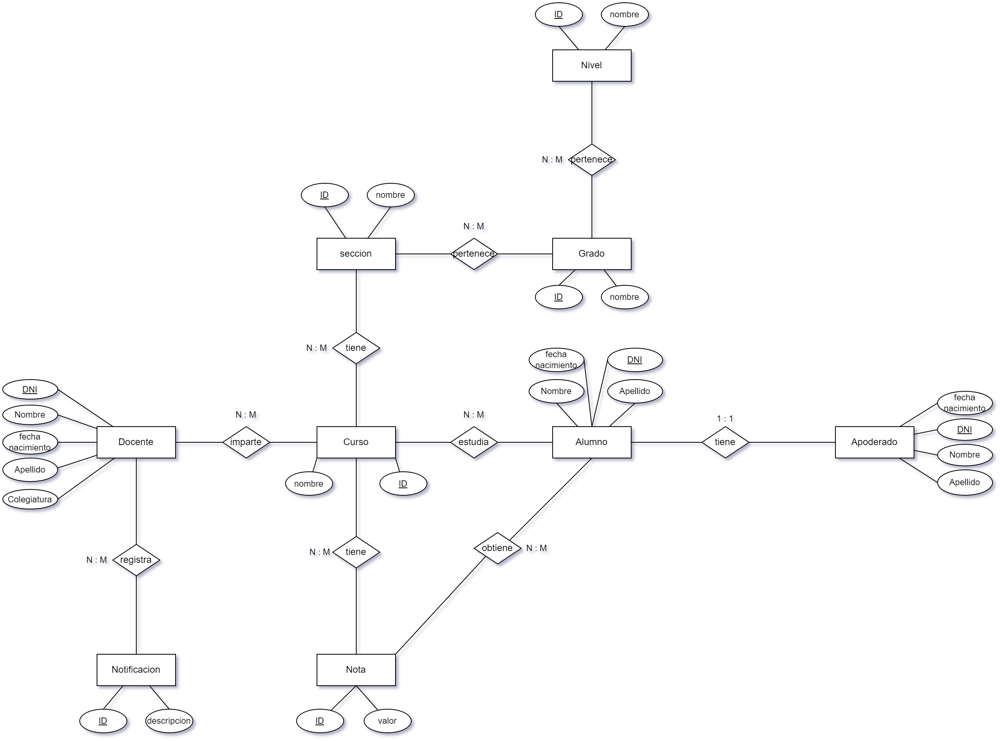

<h1 align="center">Plataforma Académica</h1>

## Contenido del proyecto:

- [Problemática](#Problemática)
- [Aplicaciones similares](#Aplicaciones-similares)
- [Propósito del proyecto](#Propósito-del-proyecto)
- [Requisitos](#Requisitos)
- [Diagramas](#Diagramas)

## Problemática

Actualmente hay estudiantes que por falta de atención del padre/apoderado ya que trabajan, faltan a clases, no rinden bien en sus estudios. Entonces nosotros buscamos resolver la comunicación entre instituciones educativas , primaria o secundaria, y apoderados/padres generado por la falta de comunicación con los estudiantes  eliminando el uso de aplicaciones de terceros que podrían vulnerar el entorno del docente o del padre/apoderado. Cambio ejemplo

## Aplicaciones similares

- Portal Academico ULASALLE
- PowerSchool
- Infinite Campus
- Schoology

## Propósito del proyecto

Nuestro propósito es crear una plataforma web eficiente y fácil de usar con una interfaz minimalista el registro de notas y asistencias del estudiante para instituciones educativas. Nuestra meta principal es proporcionar a profesores, padre/apoderado y estudiantes una herramienta centralizada que simplifique el proceso de seguimiento del desempeño académico y la asistencia del estudiante. 

## Características

- Visualizacion de notas
- Visualizacion de asistencias
- Ingreso de notas del estudiante
- Ingreso de asistencia

## Requisitos

Los requisitos funcionales y no funcionales del proyecto se encuentran detallados en el siguiente documento: [Requisitos del proyecto](https://drive.google.com/file/d/1j5xsyA21bkWk6gz__MowmHE6-j_Wsw8z/view?usp=drive_link)

## Diagramas

### Diagrama entidad relación

### Diagrama casos de uso

### Diagrama de secuencia

## Mockups

El proyecto propuesto busca tener una interfaz minimalista, con los mockups se busca diseñar la parte visual del proyecto propuesto. El proyecto es progresivo con la que los mockups es una muestra, guia o expectative de como se vera la ionterfaz.

### Avance del Proyecto

- Login Web/Movil: EL usuario tendra que iniciar sesión para hacer uso de las funciones que ofrece la pagina web, si no tiene cuenta tendra que registrarse.

- Interfaz de Inicio: Pantalla de inicio tanto para Apoderado como para Docente.

- Cambiar Contraseña: El usuario podra recuperar su contraseña en caso no se acuerde.

- Visualizar Notas: El apoderado/padre/usuario tendra la opcion de ver las notas del estudiante.

- Visualizar Asistencia:  El apoderado/padre/usuario tendra la opcion de ver las asistencia del estudiante.

- Ingreso de notas del Docente: Aqui se muestra la interfaz del ingreso de notas.

- Ingreso de asistencia del Docente: El docente podra tomar asistencia a los alumnos presentes en el aula.

